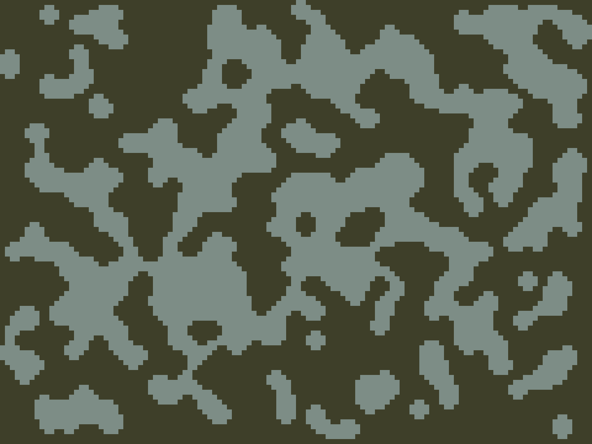
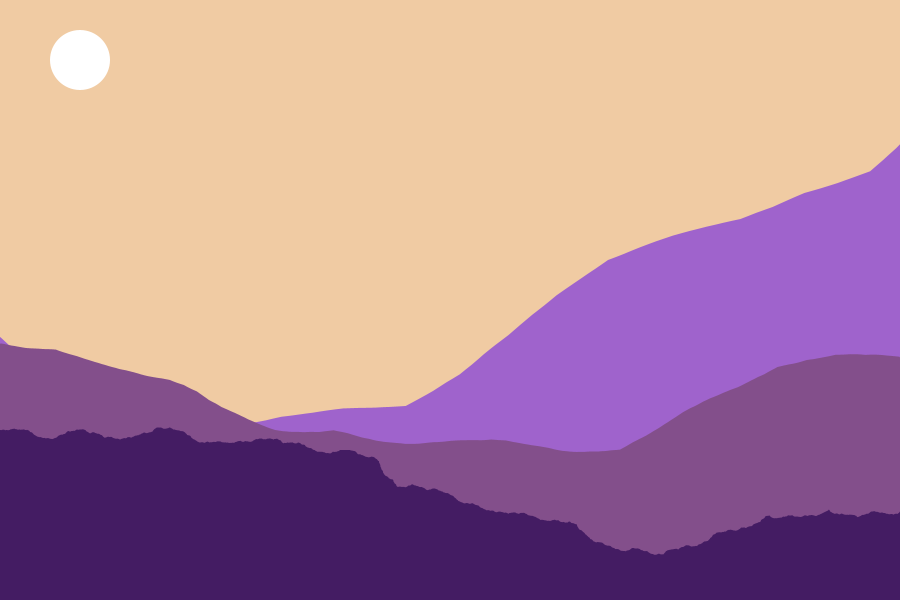
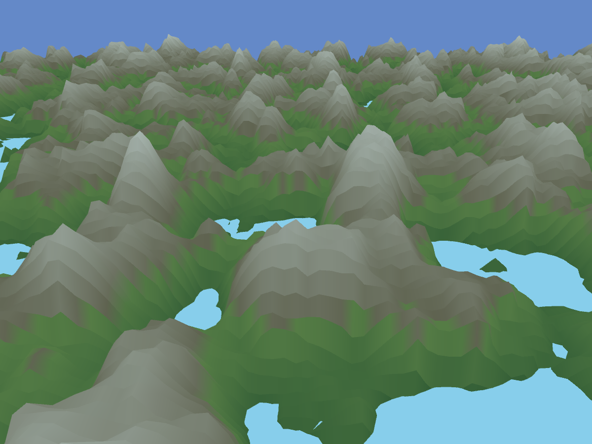

# Procedural Terrain Generation

This project explores three different approaches to procedural terrain generation, each suited for different applications and visual styles.

## Techniques Implemented

### 1. Cellular Automata Cave Generation
**Use Case:** Top-down map-like terrain generation  
**Algorithm:** Cellular automata for organic cave systems  
**Output:** Cave-like structures with natural-looking passages and chambers

### 2. Midpoint Displacement 2D Terrain
**Use Case:** 2D side-scrolling terrain generation  
**Algorithm:** Modified midpoint displacement with parallax effects  
**Output:** Layered mountain silhouettes suitable for game backgrounds

### 3. Noise-Based 3D Height Maps
**Use Case:** 3D terrain generation  
**Algorithm:** Perlin noise-based height map generation with endless scrolling  
**Output:** Realistic 3D landscapes with mountains, valleys, and water features

## Creative Enhancements

- **2D Terrain:** Enhanced midpoint displacement algorithm to create parallax effects commonly seen in games
- **3D Terrain:** Implemented endless scrolling functionality for continuous terrain exploration

## Technical Foundation

The basic implementation concepts were adapted from [CMU's Terrain Generation Guide](https://www.cs.cmu.edu/~112/notes/student-tp-guides/Terrain.pdf), with significant creative modifications and enhancements.

## Future Work

- **Worley Noise:** Explore alternative noise implementations for different terrain characteristics
- **Height Map Variations:** Compare different height map generation techniques and their visual effects
- **Dimensional Conversion:** Adapt cellular automata cave generation for 2D and 3D applications
- **Algorithm Combinations:** Explore hybrid approaches combining multiple generation techniques

The possibilities for procedural terrain generation are endless, with each technique offering unique advantages for different applications and aesthetic goals.